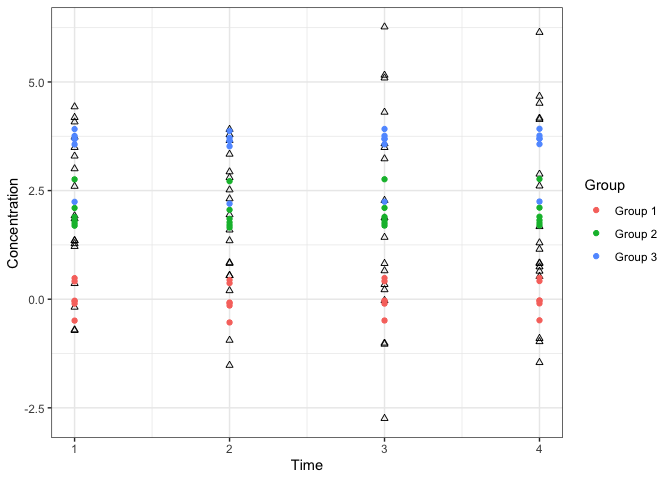
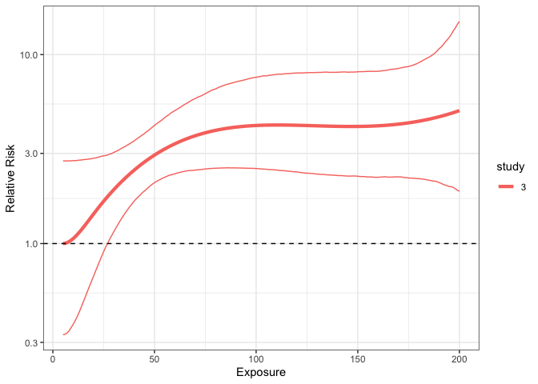

<!-- README.md is generated from README.Rmd. Please edit that file -->

# bercs

Bayesian Exposure-Response Curves via STAN

This R package implements a two flexible hierarchical models. The
**exposure model** is designed for modeling highly-variable, clustered,
sparse longitudinal exposure measurements. The **outcome model** is
designed for estimating exposure-response curves, with particular focus
on settings where data from multiple studies are being pooled.

An application of these models to household air pollution and
respiratory infections is provided in:

Keller JP, Katz J, Pokhrel AK, Bates MN, Tielsch J, and Zeger SL. A
Hierarchical Model for Estimating the Exposure-Response Curve by
Combining Multiple Studies of Acute Lower Respiratory Infections in
Children and Household Fine Particulate Matter Air Pollution. In press.
*Environmental Epidemiology.*

## Installation

This package uses the Stan language and depends on the `rstan` package.
To install `bercs`, use the following commands:

    devtools::install_github("jpkeller/bercs")

## Exposure Model

The exposure model is a hierarchical model for concentrations as a
function of group means, cluster random effects, unit (e.g. subject or
household) random effects, and temporal spline. The general procedure
for fitting the model is the following:

1.  Create the data object using `create_standata_exposure()`. This
    function creates a list with the named components used in model
    fitting.

<!-- end list -->

``` r
# Create simulated data with:
#  3 groups
#  each with 6 units
#  that each have 4 observations
#  at times 1, 2, 3, 4
exposure_standata <- create_standata_exposure(group=rep(1:3, each=24),
                                              conc=rnorm(n=72,mean=rep(c(0, 2, 4), each=23)),
                                              unit_id=rep(1:18, each=4),
                                              time=rep(1:4, times=18))
```

2.  If using a time spline, add the corresponding matrix of spline
    values to the model.

<!-- end list -->

``` r
# Add natural splines with 3 df
Mt <- create_spline_matrix(x=exposure_standata$time,
                    df=3,
                    fn="ns")
exposure_standata <- add_spline_time(exposure_standata, Mt=Mt)
```

3.  Add the hyperparameters for the prior distributions.

<!-- end list -->

``` r
# Use defaults for all except sigmaI
exposure_standata <- add_priors(exposure_standata,
                                sigmaI=c(0, 0.5))
```

4.  Sample from the posterior distribution of parameters using STAN.

<!-- end list -->

``` r
exposure_mod_fit <- sample_exposure_model(exposure_standata,
                                          B=1000,
                                          chains=4)
```

``` r
print(exposure_mod_fit,
      pars=c("muW", "reI_raw", "reI", "etaG_raw", "theta_raw"),
      include=FALSE)
```

    ## Inference for Stan model: exposure_model.
    ## 4 chains, each with iter=2000; warmup=1000; thin=1; 
    ## post-warmup draws per chain=1000, total post-warmup draws=4000.
    ## 
    ##                  mean se_mean   sd    2.5%     25%     50%     75%   97.5%
    ## sigmaG           1.86    0.01 0.46    1.14    1.53    1.80    2.14    2.95
    ## sigmaI           0.42    0.01 0.23    0.03    0.25    0.42    0.57    0.88
    ## sigmaW           1.31    0.00 0.13    1.09    1.23    1.31    1.40    1.58
    ## sigmaTheta[1]    0.38    0.01 0.33    0.01    0.14    0.29    0.53    1.24
    ## etaG[1]          0.09    0.01 0.35   -0.61   -0.14    0.09    0.31    0.76
    ## etaG[2]          2.08    0.01 0.35    1.40    1.86    2.08    2.32    2.77
    ## etaG[3]          3.49    0.01 0.34    2.79    3.27    3.49    3.71    4.16
    ## theta[1]         0.02    0.00 0.30   -0.60   -0.12    0.00    0.16    0.70
    ## theta[2]        -0.08    0.00 0.36   -0.89   -0.23   -0.03    0.08    0.60
    ## theta[3]         0.12    0.00 0.26   -0.34   -0.03    0.06    0.26    0.74
    ## sigma2I          0.23    0.01 0.22    0.00    0.06    0.17    0.33    0.78
    ## sigma2W          1.75    0.01 0.34    1.19    1.50    1.71    1.95    2.50
    ## sigma2G          3.69    0.04 1.93    1.30    2.35    3.23    4.56    8.71
    ## lp__          -164.71    0.14 4.71 -174.34 -167.77 -164.56 -161.21 -156.36
    ##               n_eff Rhat
    ## sigmaG         2760    1
    ## sigmaI         1396    1
    ## sigmaW         3473    1
    ## sigmaTheta[1]  3005    1
    ## etaG[1]        4427    1
    ## etaG[2]        4704    1
    ## etaG[3]        4328    1
    ## theta[1]       5284    1
    ## theta[2]       5229    1
    ## theta[3]       4776    1
    ## sigma2I        1596    1
    ## sigma2W        3464    1
    ## sigma2G        2849    1
    ## lp__           1089    1
    ## 
    ## Samples were drawn using NUTS(diag_e) at Wed Sep 30 15:49:10 2020.
    ## For each parameter, n_eff is a crude measure of effective sample size,
    ## and Rhat is the potential scale reduction factor on split chains (at 
    ## convergence, Rhat=1).

5.  Compute long-term means and plot them.

<!-- end list -->

``` r
fitted_means <- compute_fitted_mean(stanfit=exposure_mod_fit,
                                    standata=exposure_standata)
summary(fitted_means)
```

    ##    Min. 1st Qu.  Median    Mean 3rd Qu.    Max. 
    ## -0.3192  0.2389  2.0533  1.8967  3.4069  3.8837

``` r
# Plots the fitted values (colored points) on top of original data (black outlines).
plot_exposure_means_bytime(stanfit=exposure_mod_fit,
                           standata=exposure_standata)
```

<!-- -->

## Exposure-Response (Outcome) Model

The outcome model is a hierarchical model for estimating an
exposure-response function. It can accommodate data from multiple
studies, each with their own measured covariates, temporal trend, and
overall risk mean. Currently, the model is designed only for binary
outcomes (i.e. logistic regression). In addition to the study-specific
time trends and covariate effects, subject-level random effects can be
included. The general procedure for fitting the model is the following:

1.  Create the data object using `create_standata_outcome()`. This
    function creates a list with the named components used in model
    fitting.

<!-- end list -->

``` r
# Dataset A has a linear exposure-response relationship
# across the exposure range of 5-50
data(casedataA)
# Dataset B has no exposure-response relationship
# and an exposure range of 50-200
data(casedataB)
outcome_combo_data <- create_standata_outcome(datalist=list(casedataA, casedataB),
                                              xdf=4,
                                              xfnargs=list(Boundary.knots=c(5, 200)))
```

2.  Add the hyperparameters for the prior distributions.

<!-- end list -->

``` r
# Use defaults for all except sigmaI
outcome_combo_data <- add_priors(outcome_combo_data,
                                 sigmaI=c(0, 0.1))
```

3.  Sample from the posterior distribution of parameters using STAN.

<!-- end list -->

``` r
outcome_combo_mod_fit <- sample_outcome_model(outcome_combo_data,
                                         B=2000,
                                         cores=4)
```

``` r
print(outcome_combo_mod_fit, pars=c("reI_raw", "reI","mui", "beta_raw"), include=FALSE)
```

    ## Inference for Stan model: outcome_model.
    ## 4 chains, each with iter=4000; warmup=2000; thin=1; 
    ## post-warmup draws per chain=2000, total post-warmup draws=8000.
    ## 
    ##              mean se_mean    sd     2.5%     25%     50%     75%   97.5% n_eff
    ## sigmaI       0.08    0.00  0.06     0.00    0.03    0.07    0.12    0.22  6022
    ## bS[1]       -1.80    0.01  0.45    -2.73   -2.09   -1.79   -1.47   -0.98  2791
    ## bS[2]       -3.07    0.02  0.82    -4.71   -3.62   -3.07   -2.50   -1.51  2739
    ## sigmaBeta    1.22    0.01  0.59     0.16    0.81    1.19    1.60    2.46  3099
    ## beta[1]      1.99    0.02  1.15     0.01    1.14    1.94    2.76    4.41  2619
    ## beta[2]     -0.30    0.01  1.03    -2.69   -0.87   -0.15    0.35    1.55  7178
    ## beta[3]     -0.32    0.01  0.96    -2.40   -0.86   -0.23    0.24    1.52  6673
    ## beta[4]      0.37    0.01  0.86    -1.23   -0.17    0.29    0.89    2.21  7951
    ## lp__      -971.55    0.29 15.95 -1004.11 -981.86 -971.17 -960.79 -941.29  2956
    ##           Rhat
    ## sigmaI       1
    ## bS[1]        1
    ## bS[2]        1
    ## sigmaBeta    1
    ## beta[1]      1
    ## beta[2]      1
    ## beta[3]      1
    ## beta[4]      1
    ## lp__         1
    ## 
    ## Samples were drawn using NUTS(diag_e) at Fri Sep 18 13:40:37 2020.
    ## For each parameter, n_eff is a crude measure of effective sample size,
    ## and Rhat is the potential scale reduction factor on split chains (at 
    ## convergence, Rhat=1).

5.  Plot the exposure-response curve

<!-- end list -->

``` r
fitted_ERC <- compute_ERC(standata=outcome_combo_data,
                             stanfit=outcome_combo_mod_fit,
                             exprange=c(5,200))
plot_ERC(fitted_ERC) + scale_y_log10()
```

<!-- -->

6.  Calculate odds ratios

<!-- end list -->

``` r
estimated_ORs <- compute_OR(standata=outcome_combo_data,
                             stanfit=outcome_combo_mod_fit,
                            expsequence = c(5, 10, 20, 50, 100, 200),
                         ref_exposure=10)
estimated_ORs
```

    ##   exposure logOR_mean    logOR_low   logOR_high   OR_mean    OR_low    OR_high
    ## 1        5 -0.1947854 -0.430240145 -0.001058144 0.8230112 0.6503529  0.9989424
    ## 2       10  0.0000000  0.000000000  0.000000000 1.0000000 1.0000000  1.0000000
    ## 3       20  0.3391810  0.002058172  0.727351189 1.4037975 1.0020603  2.0695914
    ## 4       50  1.0155959  0.007824245  2.113947364 2.7610081 1.0078549  8.2808644
    ## 5      100  1.3825783  0.001512870  2.869332079 3.9851634 1.0015140 17.6252420
    ## 6      200  1.5422606 -0.044378946  3.301674576 4.6751469 0.9565914 27.1580791
    ##   study
    ## 1     1
    ## 2     1
    ## 3     1
    ## 4     1
    ## 5     1
    ## 6     1

## Community guidelines

If you have a bug to report, are having technical issues, or want to
recommend features, please open a [Github
Issue](https://github.com/jpkeller/bercs/issues).
